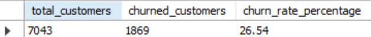
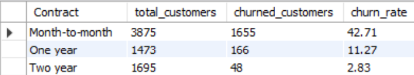
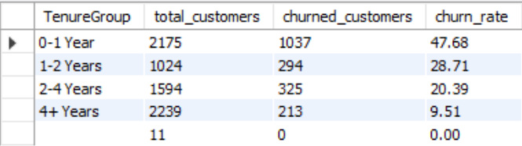

# Customer Churn Analysis

## Overview

This project analyzes telecom customer churn using the **Telco Customer
Churn dataset**.\
The objective is to identify patterns behind customer churn and present
insights through SQL analysis and an interactive Power BI dashboard.

The project demonstrates a typical data analysis workflow:

**Data Cleaning → SQL Analysis → Dashboard Visualization**

------------------------------------------------------------------------

## Tools Used

-   **Python (Pandas, Seaborn)** --- Data cleaning and preparation\
-   **MySQL** --- Analytical queries and churn metrics\
-   **Power BI** --- Interactive dashboard and visualization

------------------------------------------------------------------------

## Dataset

Dataset used: **Telco Customer Churn Dataset**

The dataset contains **7043 customer records** including:

-   Customer demographics
-   Contract type
-   Internet service type
-   Monthly and total charges
-   Tenure with the company
-   Customer churn status

------------------------------------------------------------------------

## SQL Analysis

SQL queries were used to calculate key churn metrics and identify
patterns in customer behavior.

### KPI Companies Track

### Churn Rate by Contract Type

### Churn by Tenure Group

SQL queries used for this analysis are available in:

    sql/churn_queries.sql

------------------------------------------------------------------------

## Power BI Dashboard

An interactive dashboard was created to visualize churn patterns and key
business metrics.

Dashboard includes:

-   **Total Customers**
-   **Churned Customers**
-   **Churn Rate**
-   Churn by Contract Type
-   Churn by Internet Service
-   Churn by Tenure Group
-   Monthly Charges vs Churn comparison
-   Interactive filters for deeper exploration

------------------------------------------------------------------------

## Key Insights

-   Customers with **month-to-month contracts** have significantly
    higher churn rates.
-   **New customers (0--1 year tenure)** are more likely to churn than
    long-term customers.
-   Customers who churn tend to have **higher average monthly charges**.
-   **Long-term contracts** show much stronger customer retention.

------------------------------------------------------------------------

## Project Structure

    Customer-Churn-Analysis
    │
    ├── dataset
    │   └── telco_clean.csv
    │
    ├── notebook
    │   └── customer_churn_analysis.ipynb
    │
    ├── sql
    │   └── churn_queries.sql
    │
    ├── dashboard
    │   └── Churn_dashboard.pbix
    │
    ├── images
    │   ├── KPI_companies_track.png
    │   ├── Churn_Rate_by_Contract_Type.png
    │   ├── Churn_by_Tenure_Group.png
    │   ├── Dark-mode.png
    │   ├── Light-mode.png
    │
    ├── assets
    │   ├── light-mode.png
    │   ├── sleep-mode.png
    │
    ├── Churn_dashboard.pdf
    │
    ├── README.md
    │
    └── .gitignore

------------------------------------------------------------------------

## Author

**Lakshya Sharma**

Aspiring Data Analyst | Python • SQL • Power BI • MS Excel

- GitHub: https://github.com/slakshya-22  
- LinkedIn: https://www.linkedin.com/in/slakshya22/
